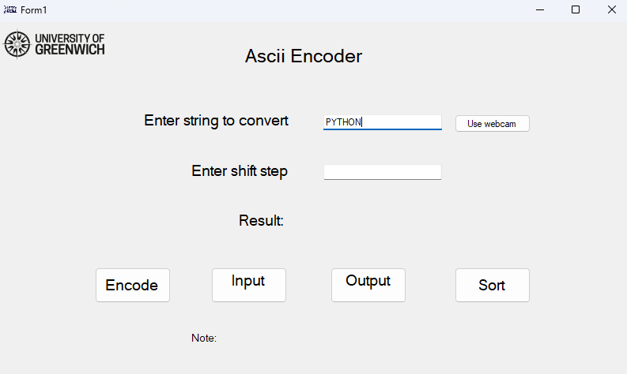

# CourseworkAppDevWinForms

## Overview

**CourseworkAppDevWinForms** is a Windows Forms application that provides advanced string processing features, including encoding, ASCII code conversion, and sorting. It also integrates with Python and computer vision libraries to allow users to input text by writing in the air with their finger, using a webcam and hand landmark detection.



*Demonstration: Hand landmark detection and air-writing recognition using Python and MediaPipe.*

---

## Features

- **String Encoding:** Shift-encode uppercase strings using a custom ASCII mapping and a user-defined step.
- **ASCII Code Conversion:** Convert strings to their ASCII codes and vice versa.
- **Sorting:** Sort the characters in the input string alphabetically.
- **Handwriting Recognition via Webcam:** Use your finger to write in the air; the app recognizes the text using Python, OpenCV, and MediaPipe, and inputs it into the application.
- **Database Integration:** Uses a local SQL database (`AsciiCode.mdf`) for ASCII code lookups.
- **Modern UI:** Built with Windows Forms, featuring clear labels, buttons, and a Greenwich logo.

---

## How It Works

### Main Functionalities

- **Encode:** Shifts each character in the input string by a specified step, wrapping around the alphabet.
- **Input Code:** Converts each character in the string to its ASCII code (custom mapping).
- **Output Code:** Converts each character in the encoded string to its ASCII code.
- **Sort:** Sorts the input string alphabetically.

### Handwriting Recognition

- Click the **"Use webcam"** button.
- The webcam window opens, and you can write in the air with your index finger.
- The app uses Python (via `pythonnet`), OpenCV, and MediaPipe to track your finger and draw your writing.
- When you finish, the app uses OCR to recognize the text and inputs it into the string field.

---

## Project Structure

```
CourseworkAppDevWinForms/
│
├── AbstractStringProcessing.cs   # Abstract class for string processing
├── StringProcessing.cs           # Implements encoding, code conversion, sorting
├── Form1.cs                      # Main form logic, Python integration, webcam
├── Form1.Designer.cs             # UI layout and controls
├── Program.cs                    # Application entry point
├── App.config                    # .NET configuration
├── AsciiCode.mdf / .ldf          # Local SQL database for ASCII codes
├── Resources/
│   └── greenwich_logo.png        # Logo used in the UI
├── Properties/
│   └── Resources.resx            # Resource definitions
├── packages.config               # NuGet dependencies
└── CourseworkAppDevWinForms.csproj # Project file
```

---

## Dependencies

- **.NET Framework 4.7.2**
- **NuGet Packages:**
  - `Microsoft.CSharp`
  - `pythonnet` (for Python interop)
  - `Tesseract` (OCR)
  - `System.Reflection.Emit`
- **Python Packages (for webcam/handwriting):**
  - `opencv-python`
  - `mediapipe`
  - `numpy`
  - `ocr_tamil` (for OCR)

---

## Setup & Usage

1. **Restore NuGet Packages:**  
   Open the solution in Visual Studio and restore NuGet packages.

2. **Python Environment:**  
   - Install Python 3.x.
   - Install required Python packages:  
     ```
     pip install opencv-python mediapipe numpy ocr_tamil
     ```
   - Set the path to your Python DLL in a file named `python.txt` in the application directory.

3. **Database:**  
   The app uses `AsciiCode.mdf` for ASCII code lookups. Ensure it is present in the project directory.

4. **Run the Application:**  
   - Build and run the project.
   - Use the UI to encode, convert, or sort strings.
   - Click "Use webcam" to input text by air-writing.

---

## Demo

The following image demonstrates the hand landmark detection and air-writing feature:


---

## Credits

- **MediaPipe** and **OpenCV** for hand tracking and drawing.
- **Tesseract** and **ocr_tamil** for OCR.
- **Greenwich University** logo used for demonstration purposes.

---

## License

This project is for educational purposes.

---

**Note:**  
Replace `<insert-your-image-path-or-link-here>` with the actual path or URL to your demonstration image. 